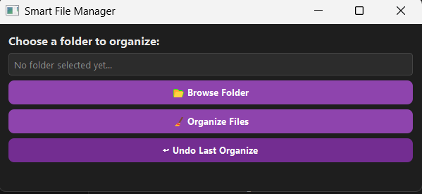

# Smart File Manager 🧠📂

A Python desktop app with GUI (PyQt5) that organizes files in a selected folder into categories like Images, Videos, Documents, etc.


## 💻 Built With
- Python 3
- PyQt5

## ⚙️ Features
- Built with **Python** and **PyQt5**
- Browse folders using GUI
- One-click file organization
- Automatically creates subfolders
- Sorts Images, Videos, Music, Docs, and more
- Processes subfolders too
- **Undo last operation** and restore original file locations

## 🚀 How to Run
```bash
python main.py
